# <h1 align="center">HotSpot 🔥</h1>

  <b>공유는 여기서, 차단은 저기서? NO!!</b>

<b>가족 데이터 공유 + 사용 제어, 흩어진 기능을 하나의 통합 서비스로</b>

---

## 🚀 HotSpot User-BE: 사용자 페이지 레포지토리

> **사용자 중심의 데이터 관리와 가족 보호 정책을 수행하는 핵심 API 서비스**
>
> USER-BE 레포지토리는 실제 요금제 가입자를 대상으로 가족 간의 데이터를 합리적으로 배분하고, 부모가 자녀의 데이터 사용 환경을 설계할 수 있도록 돕는 비즈니스 로직의 핵심부를 담당합니다. **헥사고날 아키텍처**를 채택하여 외부 기술 변화로부터 도메인 로직을 보호하며, 복잡한 데이터 집계 및 정책 적용 및 관리에 집중하고 있습니다.

 

## 📑  목차
1. [📖 레포지토리 개요](#-1-레포지토리-개요)
2. [👥 권한 및 역할 시스템 (RBAC)](#-2-권한-및-역할-시스템-rbac)
3. [✨ 주요 기능 상세](#-3-주요-기능-상세)
4. [🛠️ 핵심 정책 및 비즈니스 로직](#-4-핵심-정책-및-비즈니스-로직)
5. [🏗️ 기술적 설계 및 아키텍처](#-5-기술적-설계-및-아키텍처)
6. [💾 데이터베이스 및 ERD](#-6-데이터베이스-및-erd)

---

## 📖 1. 레포지토리 개요
서비스의 **사용자 접점(App/Web)을 지원하는 백엔드 서버**

* **주요 역할**
  * 실시간 데이터 사용 현황 대시보드
  * 가족 정책(차단/한도/우선순위) 수립 및 검증
  * 실시간 알림 전송

* **설계 지향점**
  * **도메인 중심 설계**: 외부 프레임워크나 DB 변화에 유연하게 대응하는 아키텍처 구축
  * **역할 기반 접근 제어(RBAC) 강화**
  * **보안 강화**: OAuth2 기반의 안전한 인증 및 회선 검증 체계 수립
  * **데이터 최적화**: 대용량 사용량 데이터를 효율적으로 가공하여 실시간성 확보
  * **정책 확장을 고려한 유연한 모델링**

---

## 👥 2. 권한 및 역할 시스템 (RBAC)
사용자 역할에 따라 API 접근 권한과 데이터 노출 범위를 엄격하게 제어합니다.

* **👑 OWNER (대표자)**
  * 가족 그룹의 최상위 관리자
  * 구성원 초대 및 삭제
  * 구성원 역할 변경
  * 데이터 한도 및 우선수위 정책 설정
  * 가족 정책 전반에 대한 최종 결정권 보유

* **👨‍👩‍👧 PARENT (부모)**
  * 가족 구성원의 실시간 데이터 사용 현황 확인
  * 가족 구성원게 적용된 차단 정책 현황 확인 

* **👶 CHILD (자녀)**
  * **본인**의 데이터 사용량 및 자신에게 적용된 정책 정보만 조회 가능
  * 타 구성원의 개인 정보 및 상세 사용량 접근은 API 레벨에서 원천 차단

---

## ✨ 3. 주요 기능 상세

### 3.1. 인증 및 온보딩 프로세스
* **소셜 로그인 및 실회선 검증**: 구글/카카오 OAuth2 인증 후, 전화번호와 생년월일 대조를 통해 **실제 요금제 가입자만** 서비스를 이용할 수 있도록 검증
* **승인 기반 가족 구성원 추가**: 신규 구성원 추가 시 가족관계증명서를 제출받으며, 관리자 승인 전까지 `PENDING` 상태로 관리하여 보안성 강화

### 3.2. 역할 기반 통합 대시보드
* **데이터 현황 가시화**: 공유 데이터와 개인 데이터를 통합 집계하여 실시간 잔여량을 제공
* **OWNER/PARENT**: 구성원별 데이터 점유율(%) 및 개별 할당량 대비 사용 현황을 한눈에 파악 가능
* **CHILD**: 가족 전체 총량 및 본인 사용량/정책만 조회 가능 (타 구성원 접근 불가)

### 3.3. 스마트 가족 정책 설정 및 관리 (OWNER 전용)
자녀의 올바른 디지털 습관 형성을 위해 세밀한 제어 기능을 제공
* **시간 기반 집중 모드 설정**: 요일별, 시간별(시작/종료 시간)로 데이터 통신을 자동 차단하는 정책 수립 (예: 평일 수업 시간 차단, 매일 취침 시간 차단)
* **서비스 및 앱별 핀포인트 차단**: 특정 앱(유튜브, 인스타그램 등)이나 특정 카테고리의 트래픽을 식별하여 해당 서비스만 개별적으로 제어
* **데이터 한도 관리**: 가족 공유 데이터 풀 내에서 각 구성원이 사용할 수 있는 월간 최대 사용 한도를 설정하여 특정 인원의 독점을 방지

### 3.4. 가족 구성원 및 권한 관리 프로세스
가족 그룹의 보안성과 유연성을 유지하기 위한 관리 기능 제공
* **가족 구성원 추가 및 승인**: 구성원이 제출한 가족관계증명서를 검토하고 가입 요청을 최종 승인(`APPROVED`)하거나 반려(`REJECTED`)
* **유동적인 역할 변경**: 가족 상황에 따라 구성원의 역할(OWNER, PARENT, CHILD)을 동적으로 변경하여 관리 권한을 위임 & 회수 가능
* **데이터 우선순위 정책 결정**: 공유 데이터 사용 시 경합이 발생할 경우 적용할 방식(선착순 모드 또는 사용자별 순위 기반 우선순위 모드)을 선택

### 3.5 개인 요금제 및 선물 데이터 관리
* 월별/일별 요금제 데이터 잔여량 제공 (% 표시)
* 이번 달 선물한/받은 데이터 건수 및 용량 집계
* **P2P 데이터 선물 기능**: 개인 요금제 제공 데이터 내에서 가족 내 구성원에게 데이터 선물

### 3.6 실시간 알림 시스템
* 정책 적용/위반 및 데이터 소진 임박 시 즉시 알림 발송
* **SSE(Server-Sent Events)** 기반 실시간 전송 (추후 Push/SMS 확장 예정)

### 3.7 다차원 데이터 분석 리포트
* **📊 시계열 분석**: 일 단위(당월 1일~현재), 월 단위(최근 6개월) 분석 리포트
* **📈 비교 분석**: 가족 전체 vs 나 vs 타 구성원 데이터 비교 및 앱별 상세 사용량 Top-N 랭킹 제공

---

## 🛠️ 4. 핵심 정책 및 비즈니스 로직

### 4.1. 복합 데이터 차감 우선순위 룰
데이터 소멸을 방지하고 가족 전체의 사용 효율을 극대화하기 위해, 데이터는 다음 순서로 자동 차감됨
1. **선물 받은 데이터**: 소멸 방지를 위해 최우선 차감
2. **개인 요금제 데이터**: (본인 기본 할당량 차감)
3. **가족 공유 데이터**: 개인 데이터 모두 소진 시 공용 풀에서 차감

### 4.2. 공유 데이터 배분 우선순위 정책
* **선착순 모드 (FIFO)**: 별도 제한 없이 요청 순서대로 공유 데이터 풀(Pool)에서 차감
* **우선순위 모드 (PRIORITY)**: OWNER가 설정한 우선순위에 따라 상위 순위자가 데이터를 우선 점유 및 하위 순위자의 가용량 실시간으로 제어

### 4.3. 시간 및 서비스 차단 정책
* **⏰ 시간 기반 정책**: 요일/시간 지정 차단 (예: 수면 모드 00-07시, 수업 모드 월-금 09-14시)
* **📵 앱/카테고리 차단**: 특정 앱(유튜브, 인스타그램 등) 트래픽 식별 및 차단
* **🔮 확장 계획(To-Do)**: 사용자 커스텀 정책 생성, 앱 가속(QoS), 특정 앱 전용 시간 정책 등

### 4.4. P2P 데이터 선물하기 제약 조건
* **📦 전송 조건**: 1GB 단위 / 1회 1GB ~ 5GB / 월 최대 5GB 한도 적용 (실제 통신사 정책 기반 제약 조건 참고)
* **🔐 데이터 출처 검증**: 개인 요금제 데이터만 선물 가능하며, 재선물 방지 로직 적용

---

## 🏗️ 5. 기술적 설계
### 5.2. 고변동성 데이터 (데이터 사용량) 처리를 위한 Redis 인메모리 캐싱
**데이터 사용량 및 잔여량**은 구성원들이 통신을 하거나 대시보드를 조회할 때마다 끊임없이 읽기/쓰기가 발생함

* **RDB 병목 및 Lock 방지**
  * 이처럼 갱신 주기가 매우 짧은 데이터를 RDB에서 직접 업데이트할 경우, 심각한 디스크 I/O 병목과 트랜잭션 락 경합이 발생함
  * 이를 Redis로 격리해 처리함으로써 메인 DB의 부하를 감소시킴

* **빠른 응답성과 정합성 유지**
  * 고속으로 변하는 데이터를 메모리에서 바로 읽어 사용자에게 지연 없는 실시간 대시보드를 렌더링
  * 인메모리 휘발성으로 인한 데이터 유실을 방지하기 위해 주기적 혹은 특정 이벤트 발생 시점에만 RDB로 동기화하여 성능과 안정성의 균형을 유지함

---

## 💾 6. 데이터베이스 및 ERD

```mermaid
erDiagram

    MEMBER{
        BIGINT member_id PK
        VARCHAR(10) name
        VARCHAR(6) birth "YYMMDD"
        ENUM status "APPROVED | PENDING"
        BOOL is_deleted
        DATETIME created_time
        DATETIME modified_time
    }
    
    SOCIAL_ACCOUNT {
		    BIGINT social_account_id PK
		    BIGINT member_id FK
		    VARCHAR(20) email
		    VARCHAR(20) social_id
		    VARCHAR(20) provider "KAKAO | GOOGLE"
        BOOL is_deleted
        DATETIME created_time
        DATETIME modified_time
    }

    FAMILY {
        BIGINT family_id PK
        INTEGER family_num "2~8"
        INTEGER family_data_amount "KB"
        ENUM priority_type "FIFO | PRIORITY"
        BOOL is_deleted
        DATETIME created_time
        DATETIME modified_time
    }

    FAMILY_SUB {
        BIGINT family_sub_id PK
        BIGINT sub_id FK
        BIGINT family_id FK
        ENUM family_role "OWNER | PARENT | CHILD"
        INTEGER priority
        INTEGER data_limit
    }

    SUBSCRIPTION {
        BIGINT sub_id PK
        BIGINT plan_id FK
        BIGINT member_id FK
        VARCHAR(255) phone_enc
        VARCHAR(64) phone_hash
        BOOL is_locked "차단 여부"
        BOOL is_deleted "삭제 여부"
        DATETIME created_time
        DATETIME modified_time
    }
    
    PLAN {
		    BIGINT plan_id PK
		    VARCHAR(10) plan_name
		    INTEGER plan_data_amount "KB"
		    VARCHAR(10) data_period "MONTH | DAY"
		    BOOL is_deleted
		    DATETIME created_time
		    DATETIME modified_time
	  }  
	  
	  NOTIFICATION {
        BIGINT notification_id PK
        BIGINT sub_id FK
        ENUM notification_type
        VARCHAR(50) notification_content
        DATETIME created_time
        BOOL is_read
        VARCHAR(100) event_id
    }
    
    FAMILY_APPLY {
        BIGINT family_apply_id PK
        BIGINT requester_sub_id FK
        BIGINT target_sub_id FK
        BIGINT family_id FK
        ENUM apply_type "ADD | REMOVE"
        VARCHAR(100) doc_url
        ENUM status "PENDING | APPROVED | REJECTED | CANCELLED"
        DATETIME created_time
        DATETIME modified_time
    }

    NOTIFICATION_ALLOW {
        BIGINT notification_allow_id PK
        BIGINT sub_id FK
        ENUM notification_category "DATA | POLICY | APP_SERVICE | PRESENT"
        BOOL notification_allow
        BOOL is_deleted
        DATETIME created_time
        DATETIME modified_time
    }

    PRESENT_DATA {
        BIGINT present_data_id PK
        BIGINT target_sub_id FK
        BIGINT provide_sub_id FK
        INTEGER data_amount "KB"
        DATETIME created_time
    }
    
    BLOCKED_SERVICE_SUB {
        BIGINT blocked_service_sub_id PK
        BIGINT sub_id FK
        BIGINT blocked_service_id FK
        BOOL is_deleted
        DATETIME created_time
        DATETIME modified_time
    }

    APP_BLOCKED_SERVICE {
        BIGINT app_blocked_service_id PK
        VARCHAR(20) blocked_service_name
        VARCHAR(10) blocked_service_code
        BOOL is_deleted
        DATETIME created_time
        DATETIME modified_time
    }
    
    BLOCK_POLICY {
    BIGINT block_policy_id PK
    VARCHAR(20) policy_name
    ENUM policy_type "ONCE | SCHEDULED"
    JSON policy_snapshot "기본 정책 스냅샷"
    BOOL is_deleted
    DATETIME created_time
    DATETIME modified_time
		}
		
		POLICY_SUB {
    BIGINT policy_sub_id PK
    BIGINT sub_id FK
    JSON date_snapshot "회선별 적용 스냅샷"
    BOOL is_deleted
    DATETIME created_time
    DATETIME modified_time
		}

    %% Relationships
		FAMILY ||--o{ FAMILY_SUB : has
		SUBSCRIPTION ||--o{ FAMILY_SUB : mapped
		
		MEMBER ||--o{ SUBSCRIPTION : owns
		MEMBER ||--o{ SOCIAL_ACCOUNT : has
		
		PLAN ||--o{ SUBSCRIPTION : provides
		
		SUBSCRIPTION ||--o{ NOTIFICATION : generates
		
		FAMILY ||--o{ FAMILY_APPLY : manages
		SUBSCRIPTION ||--o{ FAMILY_APPLY : requester
		SUBSCRIPTION ||--o{ FAMILY_APPLY : target
		
		SUBSCRIPTION ||--o{ NOTIFICATION_ALLOW : configures
		
		SUBSCRIPTION ||--o{ PRESENT_DATA : provide_sub
		SUBSCRIPTION ||--o{ PRESENT_DATA : target_sub
		
		SUBSCRIPTION ||--o{ BLOCKED_SERVICE_SUB : applies
		APP_BLOCKED_SERVICE ||--o{ BLOCKED_SERVICE_SUB : mapped

    SUBSCRIPTION ||--o{ POLICY_SUB : applies

```

### 6.1. 테이블 설계 핵심 전략
1.  **📱 회원(MEMBER)과 회선(SUBSCRIPTION)의 분리**
  * 한 명의 사용자가 여러 회선(스마트폰, 태블릿 등)을 가질 수 있는 통신 도메인 특성을 반영하여 데이터 귀속 주체를 회선 단위로 결정
2.  **👨‍👩‍👧 ‍가족 그룹과 매핑 테이블의 유연성**
  * 역할(Role)과 한도는 개인의 고정 속성이 아닌 '가족 그룹 내에서의 문맥'이므로, 매핑 테이블(`FAMILY_SUB`)에서 관리하여 유연한 권한 처리
3.  **🔒 워크플로우 기반의 가족 결합**
  * `FAMILY_APPLY`를 통한 상태 기반 관리와 증빙 서류 프로세스를 구조화하여 데이터 공유의 보안성 강화
4.  **⚙️ JSONB를 활용한 가변 정책 모델링**
  * 다양한 정책 형태(시간, 서비스 등)를 수용하기 위해 PostgreSQL의 **JSONB 타입**을 활용하여 스키마 변경 없는 정책 확장 설계
5.  **🎁 이벤트 기반 데이터 선물 로그**
  * 단순 잔여량 업데이트가 아닌 선물 이력(`PRESENT_DATA`)을 관리해 데이터 흐름 추적

---

## 🚀 7. 향후 고도화 계획

### 🎯 정책
* **커스텀 정책**: 정해진 프리셋 외에 사용자가 직접 차단 요일, 시간, 대상 앱을 조합하는 커스텀 정책 생성 기능 제공
* **정책 템플릿화**: 여러 정책을 하나의 템플릿으로 묶어 다수의 구성원에게 일괄 적용할 수 있는 편의 기능
* **정책 변경 이력(History) 추적**: 누가, 언제, 어떤 정책을 변경했는지 조회할 수 있는 감사 로그 기능 구현

### 📡 데이터 제어 및 트래픽 관리
* **QoS (Quality of Service) 제어**: 데이터 전면 차단 뿐만 아니라, 할당량 소진 시 400kbps 등으로 속도를 제한하는 로직 추가
* **데이터 요청(조르기) 시스템**: 구성원 간의 데이터 선물을 요청할 수 있는 조르기 기능 추가
* **앱별 트래픽 우선순위 지정**: 단순히 차단하는 것을 넘어, '교육용 앱'은 항상 최고 속도를 보장하는 등 앱별 우선순위/예외(기타 카테고리 포함) 규칙 확장

### 👨‍👩‍👧 가족 매니지먼트 기능
* **독립적인 그룹 관리**: 초기 온보딩 이후에도 자유롭게 새로운 가족 그룹을 생성하고 URL/QR 코드로 구성원을 초대하는 기능

### 🔔 알림 시스템 확장
* **다채널 알림 인프라**: 현재의 실시간(SSE) 및 앱 내 알림을 넘어, SMS 및 모바일 Push 알림으로 채널 확장
* **알림 수명 주기 관리**: 생성된 지 일정 기간(예: 30일)이 지난 알림의 자동 삭제(Soft-delete/Hard-delete) 배치 스케줄러 도입
* **채널별 수신 동의/거부**: 사용자가 정책/한도/선물 등 알림 카테고리별로 수신 채널(앱/Push/SMS)을 개별 제어할 수 있는 설정 기능