# <h1 align="center">HotSpot 🔥</h1>
<p align="center">
  <b>공유는 여기서, 차단은 저기서? NO!!</b>
</p>
<p align="center"><b>가족 데이터 공유 + 사용 제어, 흩어진 기능을 하나의 통합 서비스로</b></p>
<p align="center"><b>디지털 페어런팅의 시작, HotSpot</b></p>

</br>

---
</br>

## 📝 Overview
USER-BE 레포지토리는 실제 요금제 가입자를 대상으로 가족 간의 데이터를 합리적으로 배분하고, 부모가 자녀의 데이터 사용 환경을 설계할 수 있도록 돕는 비즈니스 로직의 핵심부를 담당합니다.  
**클린 아키텍처**를 지향하여 외부 기술 변화로부터 도메인 로직을 보호하며, 복잡한 데이터 집계 및 정책 적용 및 관리에 집중하고 있습니다.

<br>

## 📌 목차
[🚀 HotSpot User-BE: 사용자 페이지](#user)
  - [📖 개요](#user-overview)
  - [👥 권한 및 역할 시스템 (RBAC)](#user-role)
  - [✨ 주요 기능 상세](#user-feature)
  - [🛠️ 핵심 정책 및 비즈니스 로직](#user-policy)
  - [🏗️ 기술적 설계](#user-tech)

[💾 데이터베이스 및 ERD](#db)
  - [테이블 설계 핵심 전략](#db-table)

[🏛️ 아키텍처 및 디렉토리 구조](#architecture)
  - [📂 도메인별 표준 구조](#directory)
  - [🧱 레이어별 책임](#layer)
  - [🌟 아키텍처의 이점](#architecture-pros)

</br>

---
</br>


<a id="user"></a>
## 🚀 HotSpot User-BE: 사용자 페이지

**사용자 중심의 데이터 관리와 가족 보호 정책을 수행하는 핵심 API 서비스**

</br>

<a id="user-overview"></a>
## 📖 개요
서비스의 **사용자 접점(App/Web)을 지원하는 백엔드 서버**

### 1) 주요 역할
  * 실시간 데이터 사용 현황 대시보드
  * 가족 정책(차단/한도/우선순위) 수립 및 검증
  * 실시간 알림 전송


### 2) 설계 지향점
  * **도메인 중심 설계**: 외부 프레임워크나 DB 변화에 유연하게 대응하는 아키텍처 구축
  * **역할 기반 접근 제어(RBAC) 강화**
  * **보안 강화**: OAuth2 기반의 안전한 인증 및 회선 검증 체계 수립
  * **데이터 최적화**: 대용량 사용량 데이터를 효율적으로 가공하여 실시간성 확보
  * **정책 확장을 고려한 유연한 모델링**

</br>

---
</br>

<a id="user-role"></a>
## 👥 권한 및 역할 시스템 (RBAC)
사용자 역할에 따라 API 접근 권한과 데이터 노출 범위를 엄격하게 제어합니다.

### 👑 1) OWNER (대표자)
  * 가족 그룹의 최상위 관리자
  * 구성원 초대 및 삭제
  * 구성원 역할 변경
  * 데이터 한도 및 우선순위 정책 설정
  * 가족 정책 전반에 대한 최종 결정권 보유

### 👨‍👩‍👧 2) PARENT (부모)
  * 가족 구성원의 실시간 데이터 사용 현황 확인
  * 가족 구성원에게 적용된 차단 정책 현황 확인 

### 👶 3) CHILD (자녀)
  * **본인**의 데이터 사용량 및 자신에게 적용된 정책 정보만 조회 가능
  * 타 구성원의 개인 정보 및 상세 사용량 접근은 API 레벨에서 원천 차단

</br>

---
</br>

<a id="user-feature"></a>
## ✨ 주요 기능 상세

### 1) 인증 및 온보딩 프로세스
* **소셜 로그인 및 실회선 검증**: 구글/카카오 OAuth2 인증 후, 전화번호와 생년월일 대조를 통해 **실제 요금제 가입자만** 서비스를 이용할 수 있도록 검증
* **승인 기반 가족 구성원 추가**: 신규 구성원 추가 시 가족관계증명서를 제출받으며, 관리자 승인 전까지 `PENDING` 상태로 관리하여 보안성 강화
 
</br>

### 2) 역할 기반 통합 대시보드
* **데이터 현황 가시화**: 공유 데이터와 개인 데이터를 통합 집계하여 실시간 잔여량을 제공
* **OWNER/PARENT**: 구성원별 데이터 점유율(%) 및 개별 할당량 대비 사용 현황을 한눈에 파악 가능
* **CHILD**: 가족 전체 총량 및 본인 사용량/정책만 조회 가능 (타 구성원 접근 불가)
 
</br>

### 3) 스마트 가족 정책 설정 및 관리 (OWNER 전용)
자녀의 올바른 디지털 습관 형성을 위해 세밀한 제어 기능을 제공
* **시간 기반 집중 모드 설정**: 요일별, 시간별(시작/종료 시간)로 데이터 통신을 자동 차단하는 정책 수립 (예: 평일 수업 시간 차단, 매일 취침 시간 차단)
* **커스텀 정책**: 정해진 프리셋 외에 사용자가 직접 차단 요일, 시간, 대상 앱을 조합하는 커스텀 정책 생성 기능 제공
* **서비스 및 앱별 핀포인트 차단**: 특정 앱(유튜브, 인스타그램 등)이나 특정 카테고리의 트래픽을 식별하여 해당 서비스만 개별적으로 제어
* **데이터 한도 관리**: 가족 공유 데이터 풀 내에서 각 구성원이 사용할 수 있는 월간 최대 사용 한도를 설정하여 특정 인원의 독점을 방지
 
</br>

### 4) 가족 구성원 및 권한 관리 프로세스
가족 그룹의 보안성과 유연성을 유지하기 위한 관리 기능 제공
* **가족 생성 & 구성원 추가 / 삭제 및 승인**: 구성원이 제출한 가족관계증명서를 검토하고 가입 요청을 최종 승인(`APPROVED`)하거나 반려(`REJECTED`)
* **유동적인 역할 변경**: 가족 상황에 따라 구성원의 역할(OWNER, PARENT, CHILD)을 동적으로 변경하여 관리 권한을 위임 & 회수 가능
* **데이터 우선순위 정책 결정**: 공유 데이터 사용 시 경합이 발생할 경우 적용할 방식(선착순 모드 또는 사용자별 순위 기반 우선순위 모드)을 선택

</br>

### 5) 개인 요금제 및 선물 데이터 관리
* 월별/일별 요금제 데이터 잔여량 제공 (% 표시)
* 이번 달 선물한/받은 데이터 건수 및 용량 집계
* **P2P 데이터 선물 기능**: 개인 요금제 제공 데이터 내에서 가족 내 구성원에게 데이터 선물

</br>

### 6) 실시간 알림 시스템
* 정책 적용/위반 및 데이터 소진 임박 시 즉시 알림 발송
* **SSE(Server-Sent Events)** 기반 실시간 전송 (앱 내 알림 / SMS)

</br>

### 7) 다차원 데이터 분석 리포트
* **📊 시계열 분석**: 일 단위(당월 1일~현재), 월 단위(최근 6개월) 분석 리포트
* **📈 비교 분석**: 가족 전체 vs 나 vs 타 구성원 데이터 비교 및 앱별 상세 사용량 Top-N 랭킹 제공

</br>

### 8) 주간 사용량 AI 분석 리포트
* **💯 점수 기반 사용 습관 진단**: 주간 데이터 사용 패턴을 분석해 점수 산출 (Rule-based) & 지난주 대비 변화 추이를 직관적으로 제시
* **🏷️ 태그 기반 소비 패턴 명시**: 주요 사용 시간대와 앱 카테고리를 분석하여 사용자별 맞춤형 태그(예: 심야 사용 빈번, SNS 탐험가 등)를 부여하고 소비 정체성 파악
* **🛡️ 부모-자녀 양방향 맞춤 가이드**: 부모에게는 '효율적인 관리 팁'을, 자녀에게는 '자기주도적 절약 가이드'를 각각의 눈높이에 맞춰 차별화된 리포트 제공
* **⚙️ 패턴 맞춤형 커스텀 정책 추천**: 실제 소비 패턴을 학습하여 불필요한 데이터 유출을 막기 위한 최적의 차단 시간대 및 서비스별 한도 정책을 AI가 선제적으로 제안

<br/>

---

</br>

<a id="user-policy"></a>
## 🛠️ 핵심 정책 및 비즈니스 로직

### 1) 복합 데이터 차감 우선순위 룰
데이터 소멸을 방지하고 가족 전체의 사용 효율을 극대화하기 위해, 데이터는 다음 순서로 자동 차감됨
1. **선물 받은 데이터**: 소멸 방지를 위해 최우선 차감
2. **개인 요금제 데이터**: 본인 기본 할당량 차감
3. **가족 공유 데이터**: 개인 데이터 모두 소진 시 공용 풀에서 차감
</br>

### 2) 공유 데이터 배분 우선순위 정책
* **선착순 모드 (FIFO)**: 별도 제한 없이 요청 순서대로 공유 데이터 풀(Pool)에서 차감
* **우선순위 모드 (PRIORITY)**: OWNER가 설정한 우선순위에 따라 상위 순위자가 데이터를 우선 점유 및 하위 순위자의 가용량 실시간으로 제어
</br>

### 3) 시간 및 서비스 차단 정책
* **🚨 즉시 차단**: 대표자가 구성원의 모든 모바일 데이터 사용 즉시 차단
* **⏰ 시간 기반 정책**: 요일/시간 지정 차단 (예: 수면 모드 00-07시, 수업 모드 월-금 09-14시)
* **📵 앱/카테고리 차단**: 특정 앱(유튜브, 인스타그램 등) 트래픽 식별 및 차단
</br>

### 4) P2P 데이터 선물하기 제약 조건
* **📦 전송 조건**: 1GB 단위 / 1회 1GB ~ 5GB / 월 최대 5GB 한도 적용 (실제 통신사 정책 기반 제약 조건 참고)
* **🔐 데이터 출처 검증**: 개인 요금제 데이터만 선물 가능하며, 재선물 방지 로직 적용

</br>

---
</br>

<a id="user-tech"></a>
## 🏗️ 기술적 설계
### 고변동성 데이터 (데이터 사용량) 처리를 위한 Redis 인메모리 캐싱
**데이터 사용량 및 잔여량**은 구성원들이 통신을 하거나 대시보드를 조회할 때마다 끊임없이 읽기/쓰기가 발생함

* **RDB 병목 및 Lock 방지**
  * 갱신 주기가 매우 짧은 데이터를 RDB에서 직접 업데이트할 경우 발생하는 심각한 디스크 I/O 병목과 트랜잭션 락 경합 사전 차단
  * 이를 Redis로 격리해 처리함으로써 메인 DB의 부하 감소

* **빠른 응답성과 정합성 유지**
  * 고속으로 변하는 데이터를 메모리에서 바로 읽어 사용자에게 지연 없는 실시간 대시보드 렌더링 제공
  * 인메모리 휘발성으로 인한 데이터 유실을 방지하기 위해 주기적 혹은 특정 이벤트 발생 시점에만 RDB로 동기화하여 성능과 안정성의 균형을 유지

</br>

---
</br>

<a id="db"></a>
## 💾 데이터베이스 및 ERD

```mermaid
erDiagram
    %% Entities
    plan {
        BIGSERIAL plan_id PK
        VARCHAR(20) plan_name
        BIGINT plan_data_amount
        VARCHAR(10) data_period
        BOOLEAN is_deleted
        TIMESTAMP created_time
        TIMESTAMP modified_time
    }

    member {
        BIGSERIAL member_id PK
        VARCHAR(10) name
        VARCHAR(6) birth
        VARCHAR(10) status
        BOOLEAN is_deleted
        TIMESTAMP created_time
        TIMESTAMP modified_time
    }

    social_account {
        BIGSERIAL social_account_id PK
        BIGINT member_id FK
        VARCHAR(50) email
        VARCHAR(50) social_id
        VARCHAR(10) provider
        BOOLEAN is_deleted
        TIMESTAMP created_time
        TIMESTAMP modified_time
    }

    subscription {
        BIGSERIAL sub_id PK
        BIGINT plan_id FK
        BIGINT member_id FK "UK"
        VARCHAR(255) phone_enc
        VARCHAR(64) phone_hash
        INTEGER phone_key_bucket_id
        INTEGER phone_key_version
        BOOLEAN is_locked
        BOOLEAN is_deleted
        TIMESTAMP created_time
        TIMESTAMP modified_time
    }

    subscription_key {
        BIGSERIAL subscription_key_id PK
        INTEGER bucket_id "UK"
        INTEGER key_version "UK"
        TEXT encrypted_dek
        VARCHAR(255) kek_key_id
        VARCHAR(20) status
        TIMESTAMP created_time
        TIMESTAMP modified_time
    }

    family {
        BIGSERIAL family_id PK
        INTEGER family_num
        BIGINT family_data_amount
        VARCHAR(10) priority_type
        BOOLEAN is_deleted
        TIMESTAMP created_time
        TIMESTAMP modified_time
    }

    family_sub {
        BIGSERIAL family_sub_id PK
        BIGINT sub_id FK "UK"
        BIGINT family_id FK
        VARCHAR(10) family_role
        INTEGER priority
        BIGINT data_limit
    }

    notification {
        BIGSERIAL notification_id PK
        BIGINT sub_id FK "UK"
        VARCHAR(50) notification_type
        VARCHAR(100) notification_title
        VARCHAR(200) notification_content
        TIMESTAMP created_time
        BOOLEAN is_read
        VARCHAR(100) event_id "UK"
    }

    family_apply {
        BIGSERIAL family_apply_id PK
        BIGINT requester_sub_id FK
        BIGINT family_id
        VARCHAR(10) apply_type
        VARCHAR(255) doc_url
        VARCHAR(20) status
        TIMESTAMP created_time
        TIMESTAMP modified_time
    }

    family_apply_target {
        BIGSERIAL family_apply_target_id PK
        BIGINT family_apply_id FK
        BIGINT target_sub_id FK
        VARCHAR(10) target_family_role
    }

    family_remove_schedule {
        BIGSERIAL family_remove_schedule_id PK
        BIGINT target_sub_id FK
        BIGINT family_id FK
        VARCHAR(20) status
        DATE schedule_date
        TIMESTAMP created_time
        TIMESTAMP modified_time
    }

    notification_allow {
        BIGSERIAL notification_allow_id PK
        BIGINT sub_id FK
        VARCHAR(20) notification_category
        BOOLEAN notification_allow
        BOOLEAN is_deleted
        TIMESTAMP created_time
        TIMESTAMP modified_time
    }

    app_blocked_service {
        BIGSERIAL app_blocked_service_id PK
        VARCHAR(30) blocked_service_name
        VARCHAR(30) blocked_service_code
        BOOLEAN is_active
        BOOLEAN is_deleted
        TIMESTAMP created_time
        TIMESTAMP modified_time
    }

    blocked_service_sub {
        BIGSERIAL blocked_service_sub_id PK
        BIGINT sub_id FK "UK"
        BIGINT blocked_service_id FK "UK"
        BOOLEAN is_active
        TIMESTAMP created_time
        TIMESTAMP modified_time
    }

    block_policy {
        BIGSERIAL block_policy_id PK
        VARCHAR(30) policy_name
        VARCHAR(255) policy_description
        BIGINT family_id FK
        VARCHAR(20) policy_type
        JSON policy_snapshot
        BOOLEAN is_active
        BOOLEAN is_deleted
        TIMESTAMP created_time
        TIMESTAMP modified_time
    }

    policy_sub {
        BIGSERIAL policy_sub_id PK
        BIGINT sub_id FK "UK"
        BIGINT block_policy_id FK "UK"
        BOOLEAN is_active
        TIMESTAMP created_time
        TIMESTAMP modified_time
    }

    present_data {
        BIGSERIAL present_data_id PK
        BIGINT target_sub_id FK
        BIGINT provide_sub_id FK
        BIGINT data_amount
        TIMESTAMP created_time
    }

    %% Relationships
    member ||--o{ social_account : "has"
    member ||--o| subscription : "owns (1:1)"
    plan ||--o{ subscription : "applied to"
    
    subscription ||--o| family_sub : "belongs to (1:1)"
    family ||--o{ family_sub : "has members"
    
    subscription ||--o{ notification : "receives"
    subscription ||--o{ notification_allow : "configures"
    
    subscription ||--o{ family_apply : "requests"
    family ||--o{ family_apply : "targeted to"
    family_apply ||--o{ family_apply_target : "contains targets"
    subscription ||--o{ family_apply_target : "is target of"
    
    family ||--o{ family_remove_schedule : "schedules for"
    subscription ||--o{ family_remove_schedule : "target of schedule"
    
    app_blocked_service ||--o{ blocked_service_sub : "blocked in"
    subscription ||--o{ blocked_service_sub : "has blocked"
    
    family |o--o{ block_policy : "defines (optional)"
    block_policy ||--o{ policy_sub : "applied in"
    subscription ||--o{ policy_sub : "follows policy"
    
    subscription ||--o{ present_data : "provides data"
    subscription ||--o{ present_data : "receives data"
```



<a id="db-table"></a>
### 테이블 설계 핵심 전략
1) **📱 회원(MEMBER)과 회선(SUBSCRIPTION)의 분리**
  * 한 명의 사용자가 여러 회선(스마트폰, 태블릿 등)을 가질 수 있는 통신 도메인 특성을 반영하여 데이터 귀속 주체를 회선 단위로 결정
2) **👨‍👩‍👧 ‍가족 그룹과 매핑 테이블의 유연성**
  * 역할(Role)과 한도는 개인의 고정 속성이 아닌 '가족 그룹 내에서의 문맥'이므로, 매핑 테이블(`FAMILY_SUB`)에서 관리하여 유연한 권한 처리
3) **🔒 워크플로우 기반의 가족 결합**
  * `FAMILY_APPLY`를 통한 상태 기반 관리와 증빙 서류 프로세스를 구조화하여 데이터 공유의 보안성 강화
4) **⚙️ JSONB를 활용한 가변 정책 모델링**
  * 다양한 정책 형태(시간, 서비스 등)를 수용하기 위해 PostgreSQL의 **JSONB 타입**을 활용하여 스키마 변경 없는 정책 확장 설계
5) **🎁 이벤트 기반 데이터 선물 로그**
  * 단순 잔여량 업데이트가 아닌 선물 이력(`PRESENT_DATA`)을 관리해 데이터 흐름 추적

</br>

<a id="architecture"></a>
## 🏛️ 아키텍처 및 디렉토리 구조 (Clean Architecture)

<a id="directory"></a>
### 📂 도메인별 표준 구조 (예시: {domain} 기반)
모든 비즈니스 도메인은 아래와 같은 범용적인 레이어링 규칙을 따르며, 핵심 로직은 외부 환경의 변화에 영향을 받지 않도록 격리됩니다.

```
src/main/java/hotspot/user/{domain}
├── 📂 controller            # [Driving Adapter] API 엔드포인트 및 요청 처리
│   ├── 📂 port              # (Input Port) 애플리케이션 유스케이스 실행을 위한 진입 인터페이스
│   │   └── XxxService.java
│   ├── 📂 request           # 클라이언트 요청 데이터를 담는 객체 (DTO)
│   │   └── CreateXxxRequest.java
│   ├── 📂 response          # API 최종 응답 포맷을 정의하는 객체 (DTO)
│   │   └── XxxResponse.java
│   └── XxxController.java   # 웹 요청을 받아 서비스 계층을 호출하는 구현체
│
├── 📂 service               # [Application Layer] 비즈니스 흐름 및 유스케이스 관리
│   ├── 📂 port              # (Output Port) 외부 인프라(DB 등) 접근을 위한 인터페이스
│   │   └── XxxRepository.java
│   └── XxxServiceImpl.java  # 핵심 비즈니스 로직 조립 및 트랜잭션(@Transactional) 제어
│
├── 📂 domain                # [Domain Layer] 시스템의 핵심 비즈니스 모델 (Pure Java)
│   ├── 📂 mapper            # 도메인 모델과 엔티티/DTO 간의 상호 변환 로직
│   │   └── XxxMapper.java
│   └── Xxx.java             # 프레임워크에 의존하지 않는 순수 비즈니스 객체 및 규칙
│
└── 📂 infrastructure        # [Driven Adapter] 기술적 세부 구현 및 인프라 연동
    ├── 📂 repository        # 데이터베이스 접근 구현 계층
    │   ├── XxxRepositoryImpl.java # 서비스 계층의 Output Port를 실제로 구현
    │   └── XxxJpaRepository.java  # Spring Data JPA 인터페이스
    └── XxxEntity.java       # DB 테이블과 1:1 매핑되는 JPA 엔티티 객체
```

<a id="layer"></a>
### 🧱 레이어별 책임
1. **Domain Layer (Core)**
  * 서비스의 핵심 비즈니스 규칙을 담고 있는 순수 자바 객체
  * 특정 프레임워크(Spring)나 라이브러리에 의존하지 않아 유지보수성과 테스트 용이성이 높음
2. **Application Layer (Use Cases)**
  * 사용자 요청에 따른 유스케이스(비즈니스 흐름)를 조립 및 트랜잭션 관리
  * **Port(Interface)** 를 통해 외부와 소통, 실제 구현체는 런타임에 주입받음
3. **Adapters (Infrastructure & Web)**
  * **Driving Adapter (Web)**: 사용자의 HTTP 요청을 받아 DTO로 변환 & 애플리케이션 유스케이스 호출
  * **Driven Adapter (Persistence/External)**: DB 저장(JPA, Redis)이나 외부 알림 발송(SMS, Kafka) 등 구체적인 기술적 구현을 담당

<a id="architecture-pros"></a>
### 🌟 아키텍처의 이점
*   **기술 교체의 유연성**: DB를 JPA에서 다른 기술로 바꾸거나 외부 메시징 시스템을 변경해도 도메인 로직을 수정할 필요 없음
*   **테스트 용이성**: 외부 인프라 없이도 순수 자바 코드로 도메인과 유스케이스에 대한 단위 테스트 가능
*   **코드 응집도 향상**: 기능별로 레이어가 명확히 분리되어 있어 협업과 코드 파악이 용이함